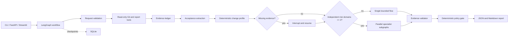

# ReleaseProof · 发布验收助手

> Evidence-grounded release acceptance for AI-assisted software delivery.

ReleaseProof 根据验收条件、Git 变更、测试报告和 CI 快照，回答一个比“代码看起来如何”更窄的问题：**每条验收条件目前有什么可反查的实现证据和验证证据，还缺什么？**

它不会修改代码、执行模型生成的命令、评论 PR、合并分支或批准上线。最终建议刻意命名为 `ready_for_human_review`，而不是“已批准”。

## 为什么做这个项目

AI 编程工具让代码生成更快，但以下等式依然不成立：

```text
PR 描述说完成了 ≠ 需求真的完成
测试全部通过 ≠ 每条验收条件都有测试
代码中出现相关逻辑 ≠ 行为经过验证
Agent 给出肯定结论 ≠ 有工程证据支持
```

ReleaseProof 把自然语言验收条件拆开，再用受限的只读工具收集事实，生成“已支持、部分支持、未支持、无法判断”的证据矩阵。它是发布验收证据助手，不是通用代码审查器。

## 当前可运行范围

- FastAPI、CLI 和 Streamlit 三个入口；
- 本地 Git 固定只读命令：ref、变更摘要、文件列表、限长 Diff；
- JUnit XML、coverage XML/JSON、CI JSON 快照解析；
- 保留来源、locator 和 SHA-256 的证据账本；
- 默认使用离线验收条件提取 baseline；开启在线模式后，DeepSeek 通过强制 schema tool 提交结构化验收条件；
- LangGraph 状态图、SQLite checkpoint、动态 interrupt/resume；
- LangGraph 不可用时，核心领域流程仍可离线测试和运行；
- API、迁移、测试、运行时等结构化 specialist；在线单路由串行分析，多路由仅在资格门禁通过后并行；
- 只有至少两个独立风险域时，`auto` 才进入并行 specialist subgraphs；
- 三个按变更类型激活的 Agent Skills；
- GitHub MCP 只读 anti-corruption adapter、fake 契约测试，以及官方 SDK stdio 协议握手与工具调用测试；
- JSON/Markdown 报告、固定离线评测和 Badcase fixtures；
- Docker、GitHub Actions、ruff、pyright、pytest。

## 核心架构



关键分层：

- Adapter 只获取和标准化事实，不做发布判断；
- Domain 模型、证据校验与策略门禁不依赖 LangGraph；
- Graph 只负责状态、路由、暂停恢复和预算；
- Skill 提供重复检查流程，不扩大工具权限；
- MCP 只是远程证据接入层，不是 Agent 的“大脑”；
- LLM 负责语义理解和解释，不能突破确定性策略上限。

当前证据工具由工作流按固定白名单和预算确定性调用，模型不会自主选择或循环调用仓库工具。在线模型使用的 forced tool 只负责提交符合 Pydantic JSON Schema 的结构化结果，因此这里称“受控工具编排”，不把它包装成通用 Tool Calling Agent。

## Quickstart

Requires Python 3.11, Git, and Docker (optional).

```bash
python -m venv .venv
source .venv/bin/activate  # or .venv\Scripts\activate on Windows
pip install -U pip
pip install -e ".[dev,mcp]"
```

Offline checks (no DeepSeek or GitHub calls):

```bash
release-proof doctor
pytest
ruff check .
pyright
```

### Demo analysis

Create a local git repo and JUnit report with demo content:

```bash
python scripts/create_demo_repo.py
```

Analyze the demo change:

```bash
release-proof analyze \
  runtime/demo-repo \
  --base HEAD~1 \
  --head HEAD \
  --requirement "- Health API returns an ok status" \
  --report reports/junit.xml
```
  --report reports\junit.xml
```

`--report` 和 `--ci-snapshot` 都是相对于被分析仓库根目录的路径；不接受仓库外绝对路径。

没有报告时，工作流返回 `awaiting_input` 并明确请求材料。通过 `resume` 补充：

```bash
release-proof resume <RUN_ID> --report reports/junit.xml
```

## API and UI

```bash
release-proof serve --host 127.0.0.1 --port 8002
```

- Swagger: <http://127.0.0.1:8002/docs>
- Health: <http://127.0.0.1:8002/health>

```bash
streamlit run src/release_proof/ui.py --server.port 8502
```

| 方法 | 路径 | 用途 |
|---|---|---|
| `POST` | `/api/v1/analyses` | 创建分析 |
| `GET` | `/api/v1/analyses/{run_id}` | 读取状态和报告 |
| `GET` | `/api/v1/analyses/{run_id}/trace` | 查看节点与工具 trace |
| `POST` | `/api/v1/analyses/{run_id}/resume` | 补充报告或人工说明 |
| `GET` | `/api/v1/skills` | 查看可激活 Skill |
| `POST` | `/api/v1/evaluations` | 运行固定离线评测 |

## 评测，而不是自报效果

仓库包含 8 个可复现的离线 change cases，覆盖：完整变更、漏实现、缺验证、迁移风险、跨域变化、提示注入、失败 CI 和异步幂等。

```bash
release-proof eval
```

对照组：

1. `direct`：只相信 PR 的完成声明，不读取工程证据；
2. `single`：结构化证据 + 单流程；
3. `gated_multi`：只在复杂切片启用并行 specialist。

报告输出 `acceptance_coverage`、`unsupported_claim_rate`、`critical_risk_recall` 和 `route_accuracy`。这些 fixtures 用于验证逻辑，不冒充生产指标；在线运行由共享 `RELEASE_PROOF_MAX_LLM_CALLS` 和单次 `RELEASE_PROOF_MAX_OUTPUT_TOKENS` 硬上限约束，真实成本与延迟仍需单独记录。

## 多 Agent 为什么不是默认

`auto` 路由必须同时满足：

- 至少两个独立风险域，例如 API + 数据迁移；
- 每个域有独立证据和结构化输出；
- 分析可以并行，不依赖另一个域的临时自然语言结论；
- 不是 docs-only；
- 最终仍由统一 evidence validator 和 policy gate 汇总。

简单 API 修改即使同时改了测试，也保持单流程；在线模式下它会串行调用同一结构化专家合约。只有多风险域合格时才并行 specialist subgraphs。这里的“多 Agent”是条件式并行专家，不是带自主工具循环的 Agent。`mode=multi` 不能绕过确定性资格门槛。

## Skills

`skills/` 中的三个能力包由变更特征按需加载：

- `api-compatibility-review`
- `database-migration-review`
- `release-readiness-review`

每个 Skill 都包含适用条件、证据要求、边界、reference 和独立只读脚本。激活后，只有与风险域匹配的 Skill 指令会进入对应在线专家的 bounded prompt；Skill 名称同时写入 trace。Skill 不会获得写仓库、评论 PR、合并或发布权限。

## GitHub MCP 边界

P0 完全支持本地仓库和 JSON 快照。`GitHubMCPReadOnlyAdapter` 只允许内部的四种读取意图，并把上游结果转换成 `EvidenceItem`。真实接入时应让 GitHub MCP Server 运行在 read-only 模式，只启用 `repos,issues,pull_requests,actions`，使用目标仓库的最小读取权限。

测试包含两个层次：fake transport 验证 allowlist、结果标准化和 anti-corruption boundary；本地只读 fixture server 则通过官方 MCP SDK 的 `ClientSession` 真正完成 stdio `initialize`、`tools/list` 和 `tools/call`。两者都不需要 PAT，也不访问 GitHub。上游 tool 名称变化只修改 adapter 的映射，不进入 domain 层。

运行真实协议本地 smoke：

```powershell
.\.venv\Scripts\python.exe scripts\smoke_mcp.py
```

输出仅包含 server/tool 名称和证据 provenance，不打印工具 payload。这个 smoke 证明本地进程间的标准 MCP 协议链路，不代表已经完成真实 GitHub MCP Server 的认证、网络、限流，也尚未接入主工作流。

## DeepSeek（可选）

All tests and the default demo are offline. To manually verify the DeepSeek Anthropic endpoint, copy `.env.example` to `.env` and fill in:

```dotenv
RELEASE_PROOF_OFFLINE=false
DEEPSEEK_API_KEY=<your key here>
DEEPSEEK_BASE_URL=https://api.deepseek.com/anthropic
DEEPSEEK_MODEL=deepseek-v4-pro
RELEASE_PROOF_MAX_LLM_CALLS=6
RELEASE_PROOF_MAX_OUTPUT_TOKENS=1800
```

The model `deepseek-v4-pro` itself has 1M context. Do not append `[1m]`: the compatibility layer silently maps unrecognized model names to Flash.

Minimal smoke (text, then forced structured tool):

```bash
python scripts/smoke_text.py
python scripts/smoke_llm.py
```

`.env` is git-ignored. The smoke outputs model, tokens, and schema validation status — not the API key.

## Docker

```bash
docker compose up --build
```

Compose 只启动应用，SQLite 保存在项目内 `runtime/`。本项目不需要 PostgreSQL、Milvus、Redis、Kafka 或 Kubernetes。

## 安全边界

- Git 命令使用固定参数数组和 `shell=False`；
- 不允许运行仓库提供或模型生成的任意命令；
- 仓库根必须显式指定，阻止绝对路径、`..`、`.git` 和 symlink 越界；
- `.env`、私钥、凭据文件、超大文件和非白名单扩展不可读取；
- Diff、Issue、PR 和源码都是不可信数据，不是系统指令；
- 工具输出限长并对 token、Authorization 和私钥模式脱敏；
- 失败 specialist 不会被伪装成完整结果；
- 证据引用失效时，策略门禁降级结论；
- JSON/Markdown 报告过滤自动授权措辞。

更多内容见 [工具安全](docs/tool-security.md)、[威胁模型](docs/threat-model.md)和 [Agent 状态](docs/agent-state.md)。

## 目录

```text
src/release_proof/
├─ adapters/      # local Git, reports, LLM, GitHub MCP
├─ api/           # FastAPI
├─ domain/        # framework-independent schemas and policy
├─ evaluation/    # fixed baseline/candidate comparison
├─ evidence/      # ledger and reference validation
├─ graph/         # workflow, checkpoint, route, specialists, stop budget
├─ prompts/       # versioned prompt registry
├─ reporting/     # JSON/Markdown
└─ ui.py          # minimal Streamlit
skills/           # reusable review procedures
evals/cases/      # offline fixtures
tests/            # no real model or GitHub calls
docs/adr/         # explicit engineering decisions
```

## 已知限制

- 这是本地单用户 P0，不包含 RBAC、租户隔离或远程仓库沙箱；
- 验收条件的离线提取器擅长 Markdown 清单，不替代复杂语义模型；
- token overlap 证据映射是透明 baseline，真实项目需用带标注数据评测后再增强；
- OpenAPI 比较器只覆盖移除/新增 path 和 operation，不替代完整兼容工具；
- 不运行陌生仓库测试，只读取用户已经生成的机器报告；
- 本地 official SDK stdio 协议会话已覆盖；真实 GitHub MCP Server 的认证、网络、限流及主工作流接入仍未覆盖；
- 真实 DeepSeek smoke 必须手动执行，CI 默认跳过；
- `ready_for_human_review` 仍需测试、技术和发布负责人判断。

## 设计文档

- [Architecture](docs/architecture.md)
- [Agent state and recovery](docs/agent-state.md)
- [Tool security](docs/tool-security.md)
- [Threat model](docs/threat-model.md)
- [Evaluation](docs/evaluation.md)
- [AI-assisted development disclosure](docs/ai-assisted-development.md)
- [ADR：默认单流程](docs/adr/0001-single-agent-by-default.md)
- [ADR：只读工具边界](docs/adr/0002-read-only-tool-boundary.md)
- [ADR：MCP 仅作适配器](docs/adr/0003-mcp-adapter-only.md)

## License

MIT
