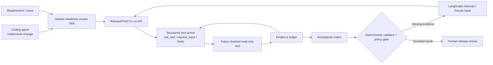

# ReleaseProof

[](https://github.com/KingHsu/release-proof/actions/workflows/ci.yml)

A human-gated acceptance layer for coding agents: map requirements to implementation and verification evidence before calling a change complete.

## Why it exists

Codex, Claude Code, and other coding agents can implement a task and run tests. Their completion message is still a claim, not release evidence. A passing test may cover the wrong criterion; a Diff may implement behavior with no verification; a cross-domain change may need rollout or rollback facts that do not exist in the repository.

ReleaseProof performs a separate, read-only acceptance pass:

- extract explicit acceptance criteria;
- let a structured planner choose one bounded Git/report read at a time from five allowed tools;
- validate every proposed tool, argument, revision, path, duplicate key, and budget in code;
- preserve locator, revision, observer, and content hash in an evidence ledger;
- match implementation and verification separately with explainable scores and evidence-kind constraints;
- pause for missing inputs, resume from a LangGraph checkpoint, and apply deterministic policy;
- return at most `ready_for_human_review` — never approval, merge, or deployment.

## Where it fits


```mermaid
flowchart LR
    A["Coding agent<br/>implements change"] --> S["release-readiness-review Skill"]
    H["Requirement / Issue"] --> S
    S --> R["ReleaseProof CLI or API"]
    R --> Q["Structured next action<br/>call_tool / request_input / finish"]
    Q --> T["Policy-checked read-only tool"]
    T --> E["Evidence ledger"]
    E --> Q
    E --> M["Acceptance matrix"]
    M --> G{"Deterministic validator + policy gate"}
    G -->|missing evidence| I["LangGraph interrupt / human input"]
    I --> R
    G -->|bounded result| P["Human release review"]
```

ReleaseProof does not compete with a coding agent and does not edit code. It is the post-coding evidence gate that the agent can invoke as a reusable workflow.

## Quickstart

Python 3.11 and 3.12 are supported.

For normal use, start the guided CLI and follow the Chinese prompts:

```powershell
Set-Location D:\path\to\release-proof
.\start-release-proof.cmd
```

On the first launch only, the script creates `.venv` and installs the runtime dependencies when
needed. All later launches reuse that environment.

The first two menu items compare evidence-supported and unsupported outcomes. The third reviews
a local Git repository and asks only for the repository, requirement, and optional test report.
Online DeepSeek planning is disabled unless the user explicitly selects it and types `ONLINE`.

See the [detailed operation guide](docs/operation-guide.md) for zero-cost and DeepSeek modes,
successful and blocked cases, and an explanation of what each recommendation means.

The commands below are developer and automation interfaces; they are not required for the
normal interactive demonstration.

```bash
python -m venv .venv
# Linux/macOS: source .venv/bin/activate
# PowerShell:  .\.venv\Scripts\Activate.ps1
python -m pip install -e ".[dev,mcp]"

# Zero-cost model-planner demo: FakeStructuredLLM uses the real NextAction schema.
python scripts/demo_bounded_agent.py

# Normal CLI path (offline deterministic planner by default).
python scripts/create_demo_repo.py
release-proof analyze runtime/demo-repo \
  --base HEAD~1 \
  --head HEAD \
  --requirement "- Health API returns an ok status" \
  --report reports/junit.xml

# This command makes no request until --confirm-paid-call is supplied.
release-proof probe-llm
```

The CLI also accepts an external UTF-8 Markdown or text file through `--requirement-file`. It reads that file as an explicit user input, stores a redacted locator instead of the host path, and never requires the file to be committed.

Before a full online analysis, `release-proof probe-llm --confirm-paid-call` makes exactly one structured-output compatibility request with SDK retries disabled and a 128-token output cap. It reports only model/usage or a safe response-shape diagnostic; prompts, response text, and credentials are not persisted.

Run the offline quality suite:

```bash
ruff check .
pyright
pytest --cov=release_proof
release-proof eval
```

## Use it from a coding agent

The repository ships an installable [`release-readiness-review`](skills/release-readiness-review/SKILL.md) Skill with a deterministic wrapper. It uses the portable `SKILL.md` pattern documented for [OpenAI Skills](https://help.openai.com/en/articles/20001066) and [Claude Agent Skills](https://platform.claude.com/docs/en/agents-and-tools/agent-skills/overview):

- Codex: copy the Skill directory into `$CODEX_HOME/skills/`;
- Claude Code: copy it into `.claude/skills/` for a project or `~/.claude/skills/` for personal use;
- other hosts: run `scripts/run_release_review.py` from the Skill directory.

The wrapper invokes the CLI with an argument array and `shell=False`, validates CLI JSON against the generated JSON/Markdown report, and removes only the temporary requirement file it created.

The original [`java-microservice-release-review`](skills/java-microservice-release-review/SKILL.md) Skill adds a read-only static scanner for recurring review questions: cross-service field propagation, enum/config omissions, batch idempotency, Oracle `NULL`/`NOT IN` and date semantics, multi-source pagination, gray rollout, and rollback. Its findings are prompts for evidence, not release verdicts, and contain no employer code or data.

## Conditional specialists, not role theatre

Simple changes stay on one bounded path. Auto mode enables independent domain specialists only when deterministic file/risk rules find at least two separable domains, such as API contract plus migration. Tests/docs do not count as independent justification by themselves.

Each specialist receives a bounded candidate evidence pack. A model may select evidence IDs, but code rejects unknown IDs and rehydrates only ledger-backed references. The final acceptance matrix and release recommendation remain deterministic.

The Java Skill is loaded only when Java/Spring/Oracle/batch/config signals are present. Its standalone scanner is an external Skill action; ReleaseProof does not pretend the scanner was executed merely because its instructions were loaded.

## Evidence matching

The v0.2 matcher replaced “any shared token” with an inspectable baseline:

- remove generic terms and normalize aliases;
- require weighted coverage, phrase or locator signals;
- enforce implementation vs verification evidence kinds;
- require explicit `passed`/`success` metadata; failed, missing, or unknown test/CI states cannot enter the verification layer;
- record score, confidence, matched terms, and signals for every accepted link;
- allow an explicit criterion ID only when it is present in trusted evidence metadata.

This is intentionally not semantic entailment. Conservative false negatives and domain vocabulary remain evaluation targets; an LLM explanation cannot override a failed deterministic match.

## Bounded execution

The graph bootstraps only the immutable change manifest and requirement. It then loops through `choose_next_action → validate_and_execute_readonly_tool → ingest_evidence → compute_evidence_gaps`. Online mode uses the configured structured LLM planner; offline mode uses a deterministic planner through the same `NextAction` and tool-harness contract.

If one online structured response violates the local schema, a run-scoped circuit breaker records safe response-shape diagnostics and any returned token usage, then routes all remaining decisions and specialists through deterministic implementations. It does not retry the same malformed plan, execute an unvalidated tool, or raise the final recommendation; the normal harness, budgets, evidence ledger, and policy gate still apply.

The planner can return only `call_tool`, `request_input`, or `finish`. It never executes directly. Code enforces the five-tool allowlist, Pydantic arguments, frozen revisions, changed-file/report manifests, path policy, stable action-key deduplication, persistent step/tool/time/no-progress limits, and bounded outputs. Every admitted business tool trace is marked `planner_selected`; rejected proposals produce no evidence.

All local Git commands use fixed argument arrays. Repository code, tests, builds, migrations, and deployments are never executed.

## Interfaces

- CLI: analyze, resume, inspect, diagnose, evaluate, and serve;
- FastAPI: create/resume analyses, retrieve report/trace, list Skills, run evaluation;
- JSON and Markdown reports for machine and human consumers;
- optional Streamlit UI;
- MCP read-only adapter with real local stdio protocol tests.

The MCP adapter is not wired into the main analysis path yet. Local Git and exported snapshots remain the supported workflow; online GitHub authentication, rate limits, and provider operations are deliberately not claimed.

## Honest scope

- Controlled fixtures validate behavior; they do not establish production recommendation accuracy.
- The bundled planner demo is a deterministic fake for reproducibility; it proves orchestration and safety behavior, not model quality.
- Conditional specialists are domain subgraphs, not autonomous agents negotiating with one another.
- The policy gate can reduce confidence but cannot prove that omitted requirements never existed.
- Requirement quality, business ownership, rollout windows, and production-only facts still require people.
- P0 is single-user and local; there is no tenant isolation, organization policy service, or remote execution sandbox.

See [architecture](docs/architecture.md), [agent state and recovery](docs/agent-state.md), [tool security](docs/tool-security.md), [evaluation](docs/evaluation.md), [v0.2 acceptance criteria](docs/v0.2-acceptance.md), and [AI-assisted development disclosure](docs/ai-assisted-development.md).

## License

MIT
